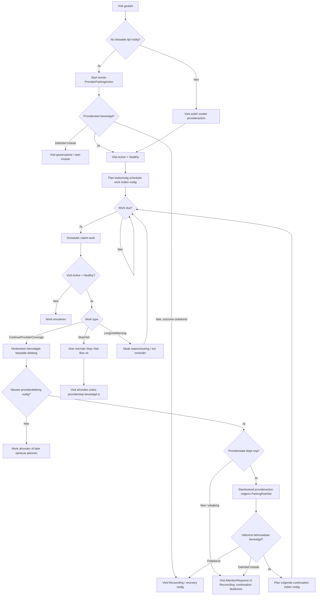

# Visit scheduler — functioneel proces

## Doel

Dit document beschrijft het **geïmplementeerde functionele gedrag** van de Visit scheduler op basis van de actuele code op `main` (2 oktober 2026).

Het doel is eerst helder te krijgen **wat het systeem daadwerkelijk doet**, vóór we de technische implementatie en betrouwbaarheid beoordelen. Dit document is dus een **as-built beschrijving**, geen uitspraak dat ieder beschreven gedrag ook gewenst of foutloos is.

De scheduler is geen bron van parkeerbeleid. Een Visit, de bij start vastgelegde policy snapshot en de geldende `ParkingRuleSet` bepalen wat functioneel mag. De scheduler zorgt dat tijdgestuurde werkzaamheden later alsnog worden uitgevoerd.

## Begrippen

- **Visit** — het logische parkeerbezoek van een gebruiker.
- **ProviderParkingAction** — één daadwerkelijke 2Park/provideractie binnen die Visit.
- **Scheduler work** — persistent toekomstig werk dat op of na een bepaald tijdstip moet worden uitgevoerd.
- **Provider coverage** — de providerdekking die nodig is tijdens een betaald parkeersegment.
- **Recovery/reconciliation** — opnieuw vaststellen van de providerwerkelijkheid wanneer lokale en externe state niet betrouwbaar gelijklopen.

## Welke werkzaamheden plant de scheduler?

De huidige implementatie kent drie soorten `VisitSchedulerWork`:

| Work type | Functioneel doel |
| --- | --- |
| `ContinueProviderCoverage` | Zorg dat een actieve Visit tijdens toekomstige betaalde tijd voldoende providerdekking krijgt. |
| `StopVisit` | Voer op een later tijdstip de normale Stop Visit-flow uit, met name wanneer een actieve provideraction verder loopt dan een verkorte `DesiredEndAt`. |
| `LongVisitWarning` | Maak een waarschuwing voor een langdurige Visit en plan eventueel een volgende reminder. |

Dit is een belangrijk verschil met de oudere technische schedulertekst, die nog maar twee work-types noemt.

## Hoofdprincipe

Een Visit is leidend; scheduler work is slechts een **uitvoeringsplan**.

Daaruit volgen functioneel deze regels:

1. scheduler work mag de Visit niet zelfstandig langer maken;
2. providerdekking wordt alleen gepland waar parkeerregels betaalde tijd aangeven;
3. de policy snapshot van de Visit begrenst maximale betaalde tijd en eventuele maximale totale Visitduur;
4. stoppen heeft voorrang op toekomstige scheduleracties;
5. een onzekere provideruitkomst moet eerst worden gereconcilieerd voordat dezelfde provider-mutatie opnieuw mag worden uitgevoerd;
6. een ongezonde Visit (`Health != Healthy`) krijgt via de normale claimer geen scheduler work aangeboden voor uitvoering;
7. work blijft persistent in de database en is daardoor niet afhankelijk van een geopende PWA of een in-memory timer.

## High-level procesflow



## Visit starten

### Start tijdens betaalde tijd

Wanneer bij het starten direct providerdekking nodig is, wordt de eerste `ProviderParkingAction` via de normale Start Visit-flow aangemaakt.

Na een **bevestigde** providerstart:

- de Visit wordt `Active`;
- de health wordt `Healthy`;
- als de Visit langer doorloopt dan de huidige provideraction wordt `ContinueProviderCoverage` gepland;
- wanneer het volgende betaalde segment direct aansluit op de huidige action, wordt de schedulercheck gepland op **vijf minuten vóór** het geplande einde van die action;
- begint het volgende betaalde segment pas later, dan wordt het work op het begin van dat betaalde segment gepland.

Een onbekende provideruitkomst zet de Visit in `Reconciling`; een definitieve mislukking annuleert de start.

### Start tijdens gratis tijd

Een Visit kan actief zijn terwijl geen provideraction nodig is.

Als er binnen de gekozen Visitperiode later wel een betaald segment bestaat, kan `ContinueProviderCoverage` op het begin van dat toekomstige betaalde segment worden gepland. De scheduler start providerdekking dus niet over gratis tijd heen.

## Providerdekking voortzetten

Voor iedere continuation wordt opnieuw gekeken naar:

- `DesiredEndAt`;
- `MaxVisitElapsedDuration` uit de Visit policy snapshot;
- `MaxPaidParkingDuration` uit de Visit policy snapshot;
- de versioned `ParkingRuleSet` voor het providerproduct;
- betaalde en gratis segmenten;
- `MaxProviderActionDuration`;
- `Continuation` uit de toepasselijke ruleset.

Voor Oss is de operationele strategie momenteel:

```text
MaxProviderActionDuration = 4 uur
Continuation              = StartNewAction
Precheck                   = T-5 minuten
```

Bij `StartNewAction` controleert de scheduler eerst opnieuw of de vorige provideraction bij de provider nog bestaat, nog `active` is en dezelfde eindtijd heeft als lokaal verwacht.

Alleen als die providerstate overeenkomt wordt een vervolgaction gestart.

Als de vorige action ontbreekt, extern gestopt is of een afwijkende eindtijd heeft, wordt niet blind een nieuwe action gemaakt. De Visit gaat naar een aandacht-/reconciliationtoestand en continuation wordt geblokkeerd.

## Gratis perioden tussen betaalde segmenten

Wanneer de huidige provideraction eindigt en het volgende betaalde segment pas later begint:

1. de Visit blijft logisch actief;
2. er wordt geen providerdekking voor de gratis periode gemaakt;
3. scheduler work wordt vrijgegeven tot het begin van het volgende betaalde segment;
4. bij het opnieuw wakker worden wordt opnieuw bepaald of providerdekking nog nodig en toegestaan is.

Een Visit van bijvoorbeeld zaterdagavond tot maandagochtend kan daardoor logisch één Visit blijven terwijl er gedurende vrije perioden geen actieve provideraction bestaat.

## Open-ended Visits

Wanneer `DesiredEndAt = null` gebruikt de scheduler een technische planningshorizon van **14 dagen** wanneer ook geen eerdere harde Visitgrens uit de policy volgt.

Die 14 dagen zijn **geen maximale Visitduur**. Het is alleen het tijdvenster waarbinnen de scheduler op dat moment vooruit kijkt. Een nog actieve open-ended Visit kan later opnieuw verder worden gepland.

## Maximale betaalde en verstreken duur

De scheduler mag niet alleen naar de provider-actionduur kijken.

Voor continuation worden ook opnieuw de Visitgrenzen gecontroleerd:

- bij `MaxVisitElapsedDuration` mag dekking niet voorbij `Visit.StartAt + MaxVisitElapsedDuration` worden gepland;
- bij `MaxPaidParkingDuration` wordt de reeds betaalde tijd vanaf `Visit.StartAt` opnieuw berekend en mag de totale betaalde tijd de policygrens niet overschrijden;
- gratis tijd telt niet mee voor `MaxPaidParkingDuration`.

Wanneer een harde Visitgrens bereikt is, wordt geen nieuwe providerdekking gestart.

## Eindtijd verlengen

Wanneer een actieve Visit naar een later tijdstip wordt verlengd:

1. de nieuwe eindtijd wordt opnieuw tegen policy en rules gevalideerd;
2. bestaand scheduler work wordt gecontroleerd;
3. als na de huidige bekende providerdekking nog betaalde tijd nodig is en geen continuation work bestaat, wordt nieuw `ContinueProviderCoverage` gepland;
4. een actief/gescheduled providerplan wordt niet onbeperkt vooraf opgebouwd: continuation blijft tijdgestuurd.

## Eindtijd verkorten

Wanneer `DesiredEndAt` naar voren wordt gehaald:

1. pending scheduler work dat op of na de nieuwe eindtijd ligt wordt geannuleerd;
2. als een actieve provideraction voorbij de nieuwe eindtijd doorloopt, wordt één `StopVisit` work-item op exact die nieuwe eindtijd gepland;
3. op dat tijdstip gebruikt de scheduler de normale duurzame Stop Visit-flow;
4. de Visit wordt pas definitief afgerond wanneer de relevante providerstop voldoende bevestigd is.

De reden hiervoor is dat de huidige Oss/2Park-integratie de eindtijd van een actieve action niet betrouwbaar kan inkorten.

## Handmatig stoppen

Een handmatige Stop Visit doet functioneel het volgende vóór nieuwe schedulercontinuation kan winnen:

- de Visit gaat naar `Stopping`;
- alle nog `Pending` scheduler work voor die Visit wordt geannuleerd;
- verdere providerstop/finalization loopt via de normale idempotente stopflow.

De scheduler-claimer controleert Visit-state opnieuw vóór work wordt uitgevoerd. Een Visit die niet meer `Active + Healthy` is krijgt via die route geen nieuw scheduler work geclaimd.

## Long Visit waarschuwingen

Bij het actief opslaan van een Visit kan, wanneer `LongVisitWarningAfter` is ingesteld, een `LongVisitWarning` work-item worden gepland op:

```text
Visit.StartAt + LongVisitWarningAfter
```

Bij uitvoering:

- de Visit moet nog `Active` zijn;
- een inboxmelding wordt gemaakt voor de bezoeker en, afhankelijk van settings, beheerders;
- als `LongVisitReminderInterval` is ingesteld en geen andere actieve warning gepland staat, wordt een volgende reminder ingepland.

### As-built aandachtspunt

De algemene scheduler-claimer geeft **alle** work-types alleen vrij wanneer de Visit zowel `Active` als `Healthy` is. Daardoor bereikt een `LongVisitWarning` voor een actieve maar bijvoorbeeld `AttentionRequired` Visit de processor niet; het work wordt door de claimer geannuleerd.

Dit document beschrijft dat uitsluitend als huidig gedrag. Of dit gewenst is wordt in de latere betrouwbaarheidscode-audit beoordeeld.

## Startup en periodieke recovery

Bij het starten van de applicatie begint de scheduler niet direct providerwerk te claimen.

Eerst moet startup recovery succesvol afronden. Als recovery faalt, blijft de worker periodiek opnieuw proberen en wordt nog geen scheduler mutation uitgevoerd.

Na succesvolle startup recovery:

- loopt de normale schedulerclaimloop;
- zonder due work wacht de worker vijf seconden;
- ongeveer iedere minuut worden unknown provider operations en actieve provideractions opnieuw met de provider gereconcilieerd;
- een fout in die periodieke providercheck stopt de schedulerloop niet; de fout wordt gelogd en scheduler work blijft doorlopen.

Wanneer recovery een externe afwijking detecteert bij een actieve provideraction, kan de Visit `AttentionRequired` worden en open scheduler work worden geannuleerd om automatische vervolgmutaties te blokkeren.

## Scheduler work lifecycle

Scheduler work heeft functioneel vier statussen:

```text
Pending -> Claimed -> Completed
                   -> Pending      (release / later opnieuw proberen)
Pending/Claimed    -> Cancelled
```

`Completed` en `Cancelled` zijn eindstatussen.

Een claim betekent dat één worker het work voor verwerking heeft verkregen. Als verwerking onverwacht faalt, kan het work weer `Pending` worden gezet met een latere `DueAt`, zolang de Visit nog `Active + Healthy` is.

## Wat de scheduler nadrukkelijk niet hoort te doen

De scheduler hoort niet:

- zelf een nieuwe functionele Visitduur te kiezen;
- user policy te vervangen;
- gratis perioden als betaald te behandelen;
- na een externe/providerafwijking blind nieuwe dekking te starten;
- een onbekende provideruitkomst simpelweg als mislukt te beschouwen en dezelfde mutation opnieuw te versturen;
- de PWA nodig te hebben om correct te blijven werken.

## Functionele scenario's voor de volgende audit

De volgende scenario's moeten hierna één voor één worden gekoppeld aan technische codepaden en geautomatiseerde tests:

1. start tijdens betaalde tijd, binnen één provideraction;
2. start tijdens betaalde tijd, langer dan vier uur;
3. start tijdens gratis tijd met later betaald segment;
4. Visit over betaald -> gratis -> betaald;
5. open-ended Visit;
6. bereiken van `MaxPaidParkingDuration`;
7. bereiken van `MaxVisitElapsedDuration`;
8. Visit verlengen;
9. Visit verkorten binnen actieve provideraction;
10. handmatig stoppen vlak vóór continuation;
11. stop terwijl continuation al geclaimd is;
12. providerstart/continuation met unknown outcome;
13. provideraction extern gestopt of gewijzigd;
14. applicatiestart/restart met pending en claimed scheduler work;
15. Long Visit warning en reminders;
16. actieve maar ongezonde Visit met gepland scheduler work.

## Nog niet beoordeeld

Dit document maakt bewust nog **geen betrouwbaarheidsconclusie** over bovenstaande flows.

De volgende stap is een technische mapping waarin per scenario wordt vastgelegd:

```text
functionele stap
  -> verantwoordelijk component
  -> database-state
  -> lock/concurrencygrens
  -> provider-call
  -> foutpad/recovery
  -> bestaande testdekking
```

Pas daarna beoordelen we welke delen aantoonbaar betrouwbaar zijn en waar code, tests of ontwerp moeten worden aangepast.
