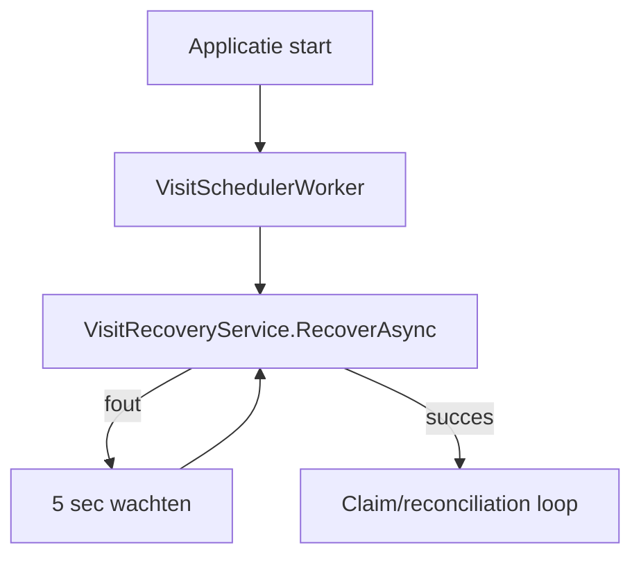
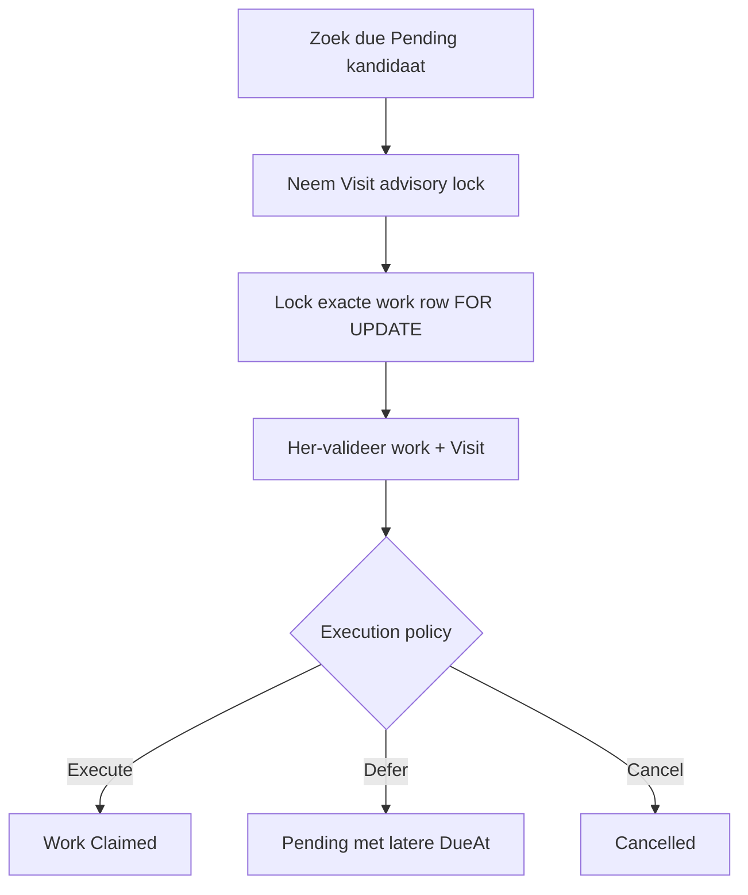
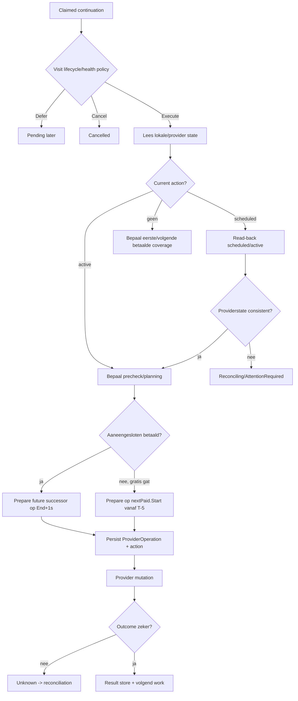
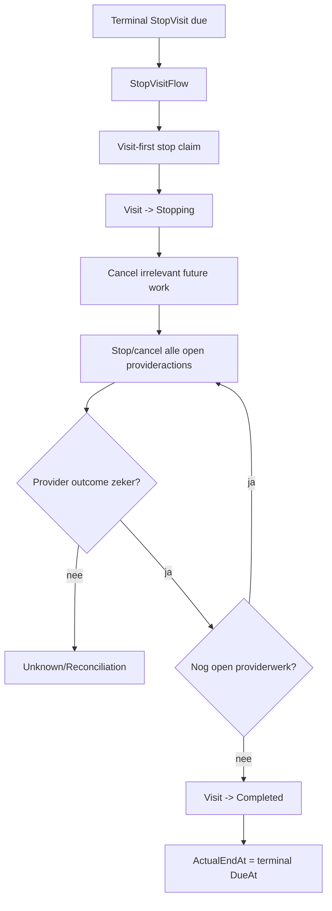

# Visit scheduler — technische procesflow

Deze pagina beschrijft de actuele as-built procesflow na de scheduler-hardening van oktober 2026.

## 1. Startup en worker gate



Nieuwe schedulerclaims beginnen pas nadat startup recovery succesvol is afgerond.

V1 deploymentcontract: exact één actieve `Parkeren.Api` / `VisitSchedulerWorker` instance.

## 2. Runtime loop

Na startup recovery:

1. worden periodiek unresolved provideroperations en actieve provideractions gereconcilieerd;
2. wordt het eerstvolgende due schedulerwork gezocht;
3. claim en mutatie worden per Visit geserialiseerd;
4. de centrale work execution policy bepaalt `Execute`, `Defer` of `Cancel`;
5. de processor voert het specifieke work-type uit;
6. onverwachte fouten releasen het work policygedreven voor retry of annuleren alleen wanneer de policy dat vereist.

## 3. Visit-first claiming



De kandidaatselectie houdt dus niet eerst een work-row lock vast terwijl op de Visit-lock wordt gewacht. Stop, end-time change, retry-release en recovery volgen dezelfde Visit-first richting.

Bij gelijke `DueAt`:

```text
StopVisit -> ContinueProviderCoverage -> LongVisitWarning
```

## 4. ContinueProviderCoverage



### Aaneengesloten betaald

```text
PrecheckAt = predecessor.PlannedEndAt - 5 minuten
Successor   = predecessor.PlannedEndAt + 1 seconde
```

### Gratis gat

```text
PrecheckAt = nextPaid.Start - 5 minuten
Successor  = nextPaid.Start
```

## 5. Provider matching

Read-back en reconciliation gebruiken `ProviderActionMatchPolicy`.

Prioriteit:

```text
known action-id
-> provider product
-> normalized plate indien relevant
-> semantic status
-> timestamps binnen 5 sec indien relevant
```

Een bekende action-id mismatch valt nooit terug naar een andere kandidaat. Zonder bekende ID moet fallback exact één unieke kandidaat opleveren.

## 6. Terminal StopVisit

`VisitTerminalBoundaryCalculator` berekent de vroegste functionele Visitgrens. `VisitTerminalWorkPlanner` bewaakt de duurzame `StopVisit`-taak en `VisitEndReason`.



Manual Stop gebruikt dezelfde orchestration maar `ActualEndAt` is dan het werkelijke stopmoment.

## 7. End-time change

`PostgresVisitEndTimeChanger` neemt eerst de Visit advisory lock.

### Verkorten

- terminal boundary opnieuw berekenen;
- obsolete terminal work vervangen;
- continuation na de nieuwe grens annuleren;
- scheduled successors die niet passen cancel/recreate;
- providerdekking voorbij de grens via durable Stop afhandelen.

### Verlengen

- policy/rules opnieuw valideren;
- terminal boundary opnieuw berekenen;
- eerdere hardere policygrens behouden;
- alleen extra benodigde betaalde coverage toevoegen.

## 8. LongVisitWarning

`LongVisitWarning` gebruikt dezelfde schedulerinfrastructuur maar niet dezelfde health-gating als continuation.

```text
Starting => Defer
Active   => Execute, ongeacht health
Stopping/Completed/Cancelled => Cancel
```

Bij uitvoering worden notification event/inboxrecords gemaakt en alleen bij een geconfigureerd reminderinterval wordt nieuw warning-work gepland.

## 9. Recovery

### Claimed schedulerwork

Startup recovery verwerkt achtergelaten claims onder Visit-lock en met dezelfde execution policy als runtime claiming.

### Stale provideroperations

Een `InProgress` operation wordt pas stale na de bestaande 5-minuten attempt lease. Daarna:

```text
InProgress -> Unknown -> provider read-back/reconciliation
```

Er wordt niet blind opnieuw gemuteerd.

### Interrupted reconciliation

Een achtergelaten `Reconciling` operation wordt teruggebracht naar een read-backbare uncertain toestand en reconciliation wordt hervat zonder de mutation te herhalen.

### Scheduler rebuild

Recovery herbouwt waar nodig:

- continuation na actieve providercoverage;
- coverage na een gratis periode;
- terminal `StopVisit` work;
- relevante state na provider discrepancy.

## 10. Open-ended horizon

Voor onbeperkte open-ended Visits gebruikt de scheduler een 14-daagse rolling horizon. Dezelfde work-item kan na het bereiken van een horizon opnieuw 14 dagen vooruit worden gepland; er ontstaat geen terminale Stop door de horizon zelf.

## 11. TwoParkMock boundary harness

Boundarytests kunnen de mockklok deterministisch besturen. Read-back leidt `scheduled -> active` dynamisch af. Visibility delay, timestamp offsets, locationlabel, post-End modes en scheduled-capacity zijn testconfigureerbaar.

Dit maakt boundary- en recoverytests deterministisch zonder onbewezen live 2Park-contracten als default te modelleren.

## 12. Observability naast de correctness-hardening

SCHED-018 — persistente Visit scheduler observability/audit trail — is afgerond. De gegroepeerde admin-Visit-timeline legt betekenisvolle overgangen vast; bestaande duurzame records blijven de bron voor actuele state en de audit-events vormen de chronologische historie. Zie [de acceptatie en verificatie](visit-scheduler-audit/SCHED-018.md).
