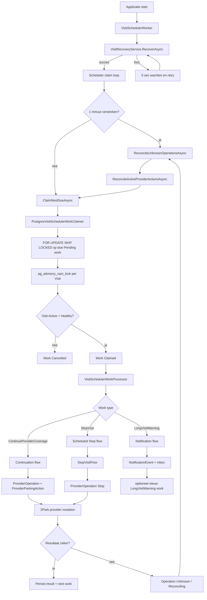
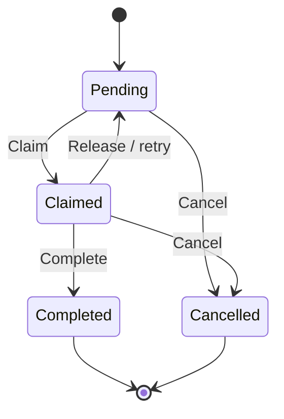
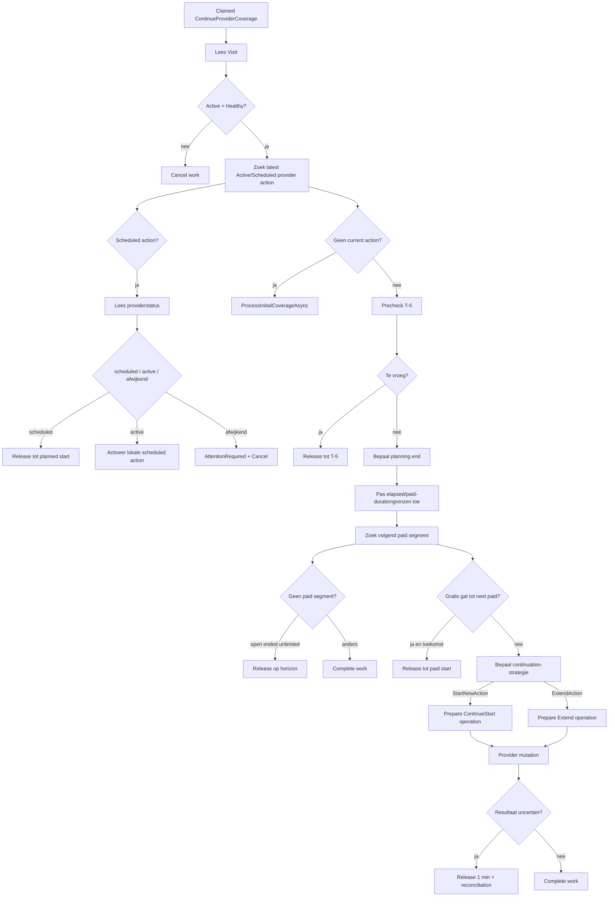
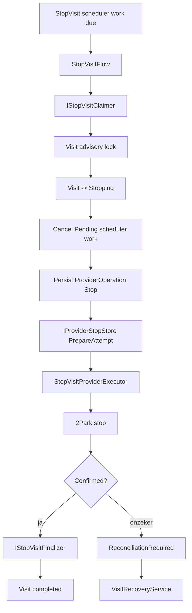

# Visit scheduler — technische procesflow

Deze pagina beschrijft de huidige **as-built** schedulerketen op `main`. Doel is niet om de implementatie al goed of fout te verklaren, maar om exact zichtbaar te maken welke component welke verantwoordelijkheid heeft, welke persistente state wordt geraakt en waar concurrency, idempotency en recovery ingrijpen.

Zie voor de functionele beschrijving: `docs/functioneel/visit-scheduler.md`.

## Technische hoofdketen



## 1. Worker lifecycle

`VisitSchedulerWorker` is een `BackgroundService` en heeft twee fasen.

### Startup gate

Bij startup wordt eerst `IVisitRecoveryService.RecoverAsync` uitgevoerd. Zolang dat faalt, wordt **geen scheduler work geclaimd**. De worker wacht vijf seconden en probeert recovery opnieuw.

Dit is een belangrijke veiligheidsgrens: geplande provider-mutaties beginnen pas nadat startup recovery succesvol is afgerond.

### Normale loop

Na recovery:

1. iedere minuut worden unresolved provider operations en actieve provideractions gereconcilieerd;
2. het eerstvolgende due work-item wordt geclaimd;
3. de processor voert het work uit;
4. zonder work wacht de worker vijf seconden;
5. bij een onverwachte exception wordt claimed work, indien nog geldig, één minuut later opnieuw Pending gemaakt.

De worker-id is procesgebonden:

```text
{MachineName}:{random Guid}
```

Hierdoor kan `ReleaseFailedAsync` controleren of dezelfde worker een claim vrijgeeft.

## 2. Persistente scheduler state

`VisitSchedulerWork` bevat onder andere:

- `Id`;
- `VisitId`;
- `Type`;
- `DueAt`;
- `Status`;
- `CreatedAt`;
- `ClaimedAt`;
- `ClaimedBy`;
- `CompletedAt`;
- `Version`.

Work types in de huidige code:

```text
ContinueProviderCoverage
StopVisit
LongVisitWarning
```

Statusflow:



## 3. Claiming en concurrency

`PostgresVisitSchedulerWorkClaimer` claimt met:

```sql
FOR UPDATE SKIP LOCKED
```

op het oudste due `Pending` work-item.

Daarna wordt binnen dezelfde transactie een PostgreSQL transactionele advisory lock op `VisitId` genomen.

Technisch betekent dit twee serialisatieniveaus:

1. **work-row lock** — twee workers verwerken niet hetzelfde work-item tegelijk;
2. **Visit advisory lock** — schedulerclaim, StopVisit en end-time-mutaties op dezelfde Visit worden geserialiseerd.

Na het verkrijgen van de Visit-lock wordt de Visit opnieuw gelezen.

Huidige claimer-regel:

```text
Visit.Status == Active
AND
Visit.Health == Healthy
```

Alle andere toestanden annuleren het geselecteerde work-item vóór verwerking.

Dit geldt momenteel voor alle drie work-types, dus ook `LongVisitWarning`. Dat is een as-built observatie die tijdens de betrouwbaarheid-/gedragsaudit beoordeeld moet worden.

## 4. ContinueProviderCoverage

`VisitSchedulerWorkProcessor` is de centrale orchestration voor continuation.

Globaal:



### PlanningEndAt

`ProviderCoverageSchedule.PlanningEndAt` kiest in deze volgorde:

1. `Visit.DesiredEndAt`, als gezet;
2. `Visit.StartAt + MaxVisitElapsedDuration`, als begrensd;
3. anders `fromAt + 14 dagen`.

Daarna past de processor ook `MaxPaidParkingDuration` toe op basis van de geldige rulesets.

### T-5 precheck

```text
PrecheckAt = providerAction.PlannedEndAt - 5 minuten
```

Als work eerder wordt verwerkt, wordt het teruggezet naar Pending met die `DueAt`.

### StartNewAction

Voor Oss is dit de gebruikte continuationstrategie.

De processor controleert eerst opnieuw de actuele provideraction. Alleen wanneer de voorganger nog exact overeenkomt met de lokale verwachting wordt een continuation voorbereid.

`ProviderContinuationStartStore`:

1. neemt opnieuw de Visit advisory lock;
2. controleert dat de Visit nog Active is;
3. controleert dat geen conflicterende provider-mutatie unresolved is;
4. hergebruikt een bestaande `ProviderOperation` wanneer hetzelfde scheduler work-id al bekend is;
5. maakt anders een nieuwe `ProviderParkingAction` plus `ProviderOperation(Type = ContinueStart)`.

Belangrijk as-built detail:

```text
nextAction.PlannedStartAt = previous.PlannedEndAt + 1 seconde
```

De nieuwe action begint dus bewust niet op exact dezelfde timestamp als de vorige provideraction.

### Idempotency

Het `VisitSchedulerWork.Id` wordt als stabiele `OperationId` gebruikt.

Daardoor geldt bij een retry:

```text
zelfde scheduler work
=> zelfde operation id
=> bestaande ProviderOperation herkennen
=> niet stilzwijgend een tweede onafhankelijke provider-mutatie starten
```

`ProviderOperation` is daarmee de persistente grens tussen scheduler orchestration en externe provider-mutatie.

## 5. Scheduled StopVisit

Een `StopVisit` scheduler item ontstaat onder andere wanneer `DesiredEndAt` wordt verkort tot vóór het einde van een actieve provideraction.

De scheduler gebruikt hiervoor niet een aparte lichtgewicht stopimplementatie. Het work wordt doorgezet naar dezelfde duurzame StopVisit-flow die ook voor normale stoplogica bestaat.



De stopclaim annuleert alle nog `Pending` scheduler-items voor dezelfde Visit. Door dezelfde Visit advisory lock te gebruiken concurreert StopVisit niet ongecontroleerd met een schedulerclaim of end-time-mutatie.

## 6. LongVisitWarning

Bij het opslaan van een actieve Visit kan `VisitStartStore` een `LongVisitWarning` work-item plannen op:

```text
Visit.StartAt + ParkingSystemSettings.LongVisitWarningAfter
```

Bij verwerking:

1. wordt gecontroleerd of de Visit nog Active is;
2. wordt een `NotificationEvent` gemaakt;
3. krijgt de bezoeker een inboxmelding;
4. afhankelijk van `NotifyAdminOnLongVisit` krijgen admins dezelfde waarschuwing;
5. als `LongVisitReminderInterval` is ingesteld wordt een volgend warning work-item gepland.

De scheduler wordt hier dus ook gebruikt als generiek tijdgestuurd mechanisme voor notificaties, niet alleen voor provider-mutaties.

## 7. End-time changes

`PostgresVisitEndTimeChanger` gebruikt dezelfde Visit advisory lock.

Een wijziging wordt geweigerd wanneer op dat moment scheduler work voor de Visit `Claimed` is.

### Verkorten

Bij een nieuwe eerdere eindtijd:

- pending work met `DueAt >= new DesiredEndAt` wordt geannuleerd;
- als een actieve provideraction voorbij de nieuwe eindtijd loopt, wordt één `StopVisit` work-item op exact die nieuwe eindtijd gemaakt;
- scheduled provideractions die door de verkorting geraakt worden moeten eerst via de aparte cancel/recreate-flow verwerkt worden.

### Verlengen

Bij verlenging:

- policy/rules worden opnieuw gevalideerd;
- als bestaande providerdekking niet tot de nieuwe eindtijd reikt, wordt indien nodig `ContinueProviderCoverage` aangemaakt;
- de `DueAt` is T-5 wanneer continuation aansluit op de huidige action, anders het begin van het volgende betaalde segment.

## 8. Recovery

`VisitRecoveryService` heeft twee rollen.

### Startup recovery

`RecoverAsync`:

1. maakt achtergelaten schedulerclaims van een eerder proces herstelbaar;
2. verwerkt pending end-time changes;
3. classificeert Visits met unresolved provider operations;
4. reconcilieert Unknown start/continuation/extend/stop-operaties;
5. bouwt schedulerplanning opnieuw op waar de classifier dat veilig acht.

De worker begint pas met nieuwe claims wanneer deze startup recovery zonder exception is afgerond.

### Periodieke reconciliation

Iedere minuut roept de worker aan:

```text
ReconcileUnknownOperationsAsync
ReconcileActiveProviderActionsAsync
```

Voor actieve provideractions wordt de provider opnieuw gelezen. Afwijkingen zoals ontbrekende action, statusverschil of onverwachte eindtijd worden persistent als discrepancy vastgelegd en kunnen de Visit naar `AttentionRequired` brengen. Open/claimed scheduler work wordt bij zo'n mismatch geannuleerd.

Daarnaast detecteert recovery provideractions die wel bij 2Park bestaan maar niet lokaal bekend zijn.

## 9. Persistente objecten en hun rol

| Object | Rol |
|---|---|
| `Visit` | Functionele parkeerintentie en lifecycle. |
| `VisitSchedulerWork` | Duurzame toekomstige opdracht voor de background worker. |
| `ProviderParkingAction` | Lokale representatie/snapshot van één concrete provideraction. |
| `ProviderOperation` | Idempotente, persistente registratie van een provider-mutatiepoging. |
| `VisitEndTimeChange` | Duurzame administratie van een wijziging van `DesiredEndAt`. |
| `ProviderDiscrepancy` | Persistente afwijking tussen lokale en providerstate. |
| `NotificationEvent` | Bronrecord voor een scheduler-gegenereerde melding. |

## 10. Locks en serialisatie

De belangrijkste muterende flows gebruiken dezelfde sleutel:

```text
VisitAdvisoryLock.For(VisitId)
```

Dit geldt onder andere voor:

- scheduler claim;
- scheduler retry-release;
- continuation preparation;
- StopVisit claim;
- end-time change;
- provider start-result persistence;
- recovery/reconciliationmutaties.

Doel: mutaties rond één Visit serialiseren, terwijl verschillende Visits wel parallel kunnen worden verwerkt.

De scheduler work-row heeft daarnaast een eigen `FOR UPDATE SKIP LOCKED` claimmechanisme.

## 11. Technische failure boundaries

Voor de latere betrouwbaarheid-audit zijn vooral deze grenzen belangrijk:

1. **voor provider-call** — lokale operation/action is al persistent voorbereid;
2. **provider-call slaagt en response wordt opgeslagen**;
3. **provider-call kan uitgevoerd zijn, maar response/result persistence faalt**;
4. **process crash terwijl work Claimed is**;
5. **process crash met ProviderOperation Unknown/InProgress**;
6. **externe providerstate wijzigt buiten Parkeren om**;
7. **Stop/end-time change concurreert met scheduler continuation**.

De architectuur probeert deze situaties niet alleen met retries op te lossen. `ProviderOperation`, Visit-locks en recovery bepalen of opnieuw muteren veilig is.

## 12. As-built aandachtspunten voor de audit

Deze pagina trekt nog geen betrouwbaarheidsconclusie. De volgende punten moeten expliciet scenario voor scenario worden beoordeeld:

- de claimer vereist `Healthy` voor **alle** work-types, inclusief `LongVisitWarning`;
- meerdere plekken gebruiken `DateTimeOffset.UtcNow` rechtstreeks terwijl andere componenten `TimeProvider` gebruiken;
- `StartNewAction` plant successor op `previous.PlannedEndAt + 1 seconde`;
- periodieke provider-reconciliation faalt soft: de worker logt de fout maar verwerkt scheduler work daarna wel verder;
- retry van een onverwachte processor-exception gebeurt standaard na één minuut;
- `StopVisit` annuleert alleen `Pending` scheduler work; concurrency met `Claimed` work wordt via de Visit-lock/claimvolgorde afgevangen;
- open-ended unlimited Visits gebruiken een rolling 14-daagse planninghorizon;
- providerstatus wordt op meerdere momenten opnieuw gelezen, waardoor de precieze regels rond missing/stopped/changed actions moeten worden getoetst;
- de scheduler processor is momenteel een zeer brede orchestrationcomponent met meerdere verantwoordelijkheden, wat testbaarheid en foutisolatie expliciet moet worden beoordeeld.

## 13. Volgende auditstap

Na deze technische mapping wordt de implementatie niet op bestand maar op **scenario** beoordeeld.

Per scenario leggen we vast:

```text
Functionele verwachting
-> betrokken componenten
-> persistente state vóór uitvoering
-> provider-call(s)
-> persistente state na succes
-> gedrag bij timeout/crash/restart
-> aanwezige tests
-> ontbrekende testdekking
-> bevinding / risico
```

De functionele scenariolijst uit `docs/functioneel/visit-scheduler.md` vormt daarvoor de checklist.
